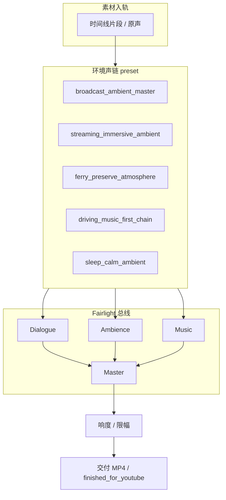
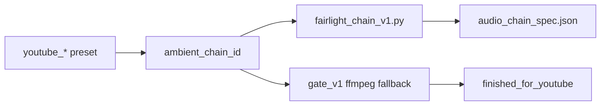

# DaVinci 环境声处理系统 v1（电台级 / Netflix 级）

**版本:** `davinci_ambient_audio_system_v1`  
**主路径:** `~/StateVerge/scripts/davinci_audio_finish/ambient_chains/`  
**配置:** `~/StateVerge/config/davinci_ambient_audio_system_v1.json`

---

## 设计原则（与 StateVerge 音频政策一致）

| 场景 | 原则 |
|------|------|
| **渡轮 Ferry** | 真实环境声为主；禁止 afftdn / Demucs / AI 人声隔离；轻度 highpass + 风噪 shelf |
| **驾车 Driving** | 音乐优先；环境声总线在有 BGM 时降低约 50–70%（链内 -60% 侧链意图） |
| **Shorts** | Envato 电影感；更高响度（-14 LUFS integrated） |
| **长片沉浸** | 保留房间 tone；可选 Fairlight NR 最多 -20 dB，**默认关闭** |
| **全局** | DaVinci Fairlight 为主；FFmpeg 仅探测/回退；**不覆盖原片** |

---

## 信号流总览



---

## 五条环境声链 — 何时使用

| Chain ID | 中文用途 | 典型内容 | YouTube finish 映射 |
|----------|----------|----------|---------------------|
| `broadcast_ambient_master` | 电台级长片环境声 | rain_night、unknown 长片 | — |
| `streaming_immersive_ambient` | Netflix 式沉浸（轻宽度） | skyline、shorts | `youtube_shorts_cinematic` |
| `ferry_preserve_atmosphere` | 保留海港/渡轮氛围 | ferry | `youtube_ferry_real` |
| `driving_music_first_chain` | 驾车音乐优先 | driving | `youtube_long_calm` |
| `sleep_calm_ambient` | 睡眠向轻柔 | sleep / calm | — |

### A. `broadcast_ambient_master`（电台级）

- Fairlight：25 Hz 温和 highpass → 轻量多段压缩 → **仅 Ambience 总线** de-esser → 有音乐时对白/环境 duck
- 响度：**-14 ~ -16 LUFS** integrated，true peak **-1.5 dBTP**
- **禁止**机器人式 NR

### B. `streaming_immersive_ambient`（Netflix 沉浸）

- Mid/Side 轻微加宽（约 12%）
- 低频环境 shelf **提升而非切除**（保留 room tone）
- 可选光谱修复：Fairlight NR **≤ -20 dB reduction**，默认关
- 长片 **-16 LUFS**；Shorts **-14 LUFS**

### C. `ferry_preserve_atmosphere`

- `highpass f=28` → `volume 0.75` → 8 kHz 以上风噪 shelf **-3 dB（尖峰）**
- 限幅 **-2 dBTP**
- **硬禁止：** afftdn, demucs, voice isolation

### D. `driving_music_first_chain`

- 音乐总线稳定；环境声在有音乐时约 **-60%**（与 routing 中 volume 0.3–0.5 一致）
- 与 `audio_modes.driving_music_first` + BGM mix 联动

### E. `sleep_calm_ambient`

- 20 Hz highpass + 14 kHz 温和 lowpass；**无压缩抽吸**

---

## Fairlight 总线布局（推荐）

```
Dialogue  ──┐
Ambience  ──┼──► Master ──► Loudness ──► Limiter
Music     ──┘
```

- Ferry 项目通常仅 **Ambience + Master**
- Driving / Shorts：**Ambience + Music + Master**（Dialogue 轨可留空）

---

## 与现有 gate / studio 集成



| 入口 | 脚本 |
|------|------|
| 单条成片 | `scripts/davinci_audio_finish/gate_v1.py` |
| 文件夹 studio | `scripts/davinci_studio/run_davinci_folder_job.py` |
| 生产 agent | `scripts/davinci_production_agent/resolve_api.py` |
| 诊断 | `scripts/davinci_audio_finish/diagnose_ambient_audio_system.py` |

---

## DaVinci Resolve 手动操作（Fairlight 页）

1. 打开时间线 → **Fairlight** 工作区  
2. 按链 ID 在 `ambient_chains/chains.json` 查看 `fairlight` 节点说明  
3. 运行 CLI 导出逐步说明与 spec：

```bash
python3 ~/StateVerge/scripts/davinci_audio_finish/fairlight_chain_v1.py \
  --chain ferry_preserve_atmosphere
```

4. 查看导出的 `audio_chain_spec_<chain>.json`（含 `manual_steps` 列表）  
5. 交付前用 **Loudness Meter** 核对 LUFS / true peak 目标  

---

## CLI 回退（Resolve 未连接时）

```bash
# 诊断 + 写 Control Center 报告
python3 ~/StateVerge/scripts/davinci_audio_finish/diagnose_ambient_audio_system.py

# YouTube finish gate（自动映射 ambient chain + ffmpeg）
python3 ~/StateVerge/scripts/davinci_audio_finish/gate_v1.py \
  --input-video /path/to/clip.mp4 --preset auto

# 单元测试
python3 ~/StateVerge/scripts/davinci_audio_finish/test_ambient_chains.py
```

FFmpeg 回退滤镜（示例，`ferry_preserve_atmosphere`）：

```
highpass=f=28,volume=0.75,firequalizer=...,alimiter=...
```

**不写入** `raw/` 或原始 airdrop；输出仅在 `finished_for_youtube/` 或 gate 约定目录。

---

## 配置文件

- `config/davinci_ambient_audio_system_v1.json` — 按 `content_type` 默认链  
- `config/stateverge_content_routing_v1.json` — 驾车/渡轮/shorts 路由意图  
- `scripts/audio/stateverge_audio_policy_v1.json` — 全局 fade / 禁止激进 denoise  

---

## Control Center

- 页面：`/davinci-audio-finish` — 可选 **环境声链** 与文档链接  
- 报告：`~/StateVerge_Control_Center/logs/davinci_ambient_audio_system_v1.md`

---

## Technical reference

| File | Role |
|------|------|
| `ambient_chains/chains.json` | Source of truth for Fairlight + ffmpeg |
| `ambient_chains/ffmpeg_fallback.py` | `-af` string builder |
| `ambient_chains/resolve_spec.py` | `audio_chain_spec.json` export |
| `fairlight_chain_v1.py` | Resolve timeline attach (metadata v1) |
| `presets.py` | `ambient_chain_id` per youtube preset |

**Marker:** stdout ends with `DAVINCI_AMBIENT_AUDIO_SYSTEM_V1_READY=true|false`
